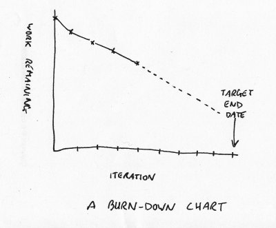

!SLIDE center transition=uncover
# SCRUM

!SLIDE transition=uncover
# Introducción 
SCRUM se basa en lo que se conoce como **Sprints**

*Un sprint concentra el esfuerzo durante un período corto de tiempo hacia metas
prefijadas*

!SLIDE smbullets small transition=uncover
# Introducción
* El **Product Owner (PO)** compila todos los pedidos planificados para el producto y
  prioriza las funcionalidades
* El resultado del trabajo del PO es el **Product Backlog**, una lista de tareas
  o **TODO** que constantemente se prioriza. Antes de cada Sprint, las tareas de
mayor prioridad son introducidas al **Spring Backlog**
* En conjunto con el usuario, los miembros del proyecto forman un **Scrum Team**
  integrado por 5-9 personas. Luego de reuniones con el PO, se determina el
objetivo del Sprint y la funcionalidad priorizada, se explota en tareas
detalladas.
  * Notar que el cliente es parte del Scrum Team
  * El Scrum Team es auto-organizado y los miembros tienen una
responsabilidad conjunta en torno a los resultados

!SLIDE smbullets transition=uncover
# Introducción
* El **Scrum Master** coordina al equipo de desarrollo, evitando cualquier
  posible impedimento, y constantemente trata de asegurar que el equipo se
encuentre en las mejores circunstancias posibles de forma de poder cumplir con
el objetivo fijado para el Sprint
  * No es necesario que sea técnico
* Cada Sprint realza el valor del producto, agregando nuevas funcionalidades y
  mejoras que pueden entregarse al cliente

!SLIDE smbullets transition=uncover
# Roles
## Scrum Team
* Son quienes resuelven problemas y diseñan soluciones. Normalmente se compone de
5 a 9 integrantes - *este número de personas en un grupo ha demostrado ser el
adecuado para este tipo de trabajos*
* Los miembros deciden cómo organizar el trabajo y cómo se realiza distribución
  de tareas. No hay roles fijados - *todos podrán cambiar de tareas con
cualquier otro miembro*. Esto no implica que no existan miembros que sean
expertos en determinado campo.

!SLIDE smbullets small transition=uncover
# Roles
## Product Owner
* Es la voz del cliente
* Asegura que el Scrum Team trabaje con una adecuada perspectiva del negocio
* Es quien administra el Product Backlog - *una lista de tareas pendientes donde
  todas las especificaciones para el producto son expresadas indicando cuán
rentables considera que son*
  * El documento debe ser visible por toda la organización de forma tal que
    **todos** estén al tanto de qué se espera en futuras versiones del producto
* El PO generalmente es el cliente, pero puede ser parte interna de la
  organización. 
* Es aconsejable que el PO tenga un perfil comercial y conozca bien los procesos
  de negocio

!SLIDE smbullets transition=uncover
# Roles
## Scrum Master
* Es una combinación de los roles de: mentor, mediador, resolver problemas y portero.
* Debe tener breves reuniones diarias con el equipo - *Daily Scrums*
* Cuando alguien externo al proyecto introduce un tema importante para discutir
  con el equipo, el Scrum Master trata de asegurar que los integrantes se distraigan 
  lo menos posible
* Debe mantener la postura de *aquí y ahora* en relación al trabajo

!SLIDE smbullets transition=uncover
# Roles
## Scrum Master
* Focaliza sus esfuerzos en facilitar al equipo con las mejores circunstancias
  para alcanzar las metas acordadas para el Sprint
* Luego de cada Sprint, el Scrum Master mantiene una reunión de evaluación con
  el equipo completo - *Retrospectiva del Sprint*
  * Se analizan experiencias y obtienen conclusiones
  * El objetivo es elevar el conocimiento global del equipo y motivar antes del
    próximo Sprint

!SLIDE smbullets transition=uncover
# Procesos
## Creando el backlog
* El PO recompila todos los requerimientos y especificaciones que son la base
  de los cambios a introducir al producto: nuevas funcionalidades y corrección
de errores
* De aquí se obtiene una lista priorizada de aquellos cambios que se desean
  porque tienen valor para la organizacion.
* Al inicio de cada Sprint el PO debería *congelar* los principales items de la
  lista y presentarlos al equipo de Scrum

!SLIDE smbullets transition=uncover
# Procesos
## El Sprint
* De los días destinados a cada sprint (generalmente 15-30 días), los primeros
  se utilizan para crear el *Sprint Backlog*
* Cuando se determian las tareas y tiempo para realizarlas, el PO deja de
  participar
* El equipo trabajará bajo su propia responsabilidad

!SLIDE smbullets small transition=uncover
# Procesos
## Scrum diario
* Cada día, a la misma hora, el Scrum Master con el equipo tienen una breve
  reunoión
* El propósito es el de *eliminar* todos los impedimentos de velocidad en el
  grupo
* Cada participante debería, de alguna manera, responder a las siguientes
  preguntas:
  * ¿Qué es lo que hizo desde la última reunión?
  * ¿Qué hará desde ahora hasta la próxima reunión?
  * ¿Hay algo que no permita avanzar en lo planificado?

*Las dos primeras preguntas ofrecen a los participantes una visión global del
avance del proyecto. La tercera, sirve para solucionar problemas*

!SLIDE smbullets transition=uncover
# Métricas
* Las tareas en el Sprint Backlog deben estimarse en cantidad de horas
  * El Sprint Backlog entonces tiene una cantidad de horas pendientes
* Diariamente podemos analizar el avance del equipo usando un gráfico conocido
  como **burn-down**

!SLIDE  transition=uncover
# SCRUM en 10 minutos
## Un video ágil

<iframe width="560" height="315" src="//www.youtube.com/embed/XU0llRltyFM" frameborder="0" allowfullscreen> </iframe>

