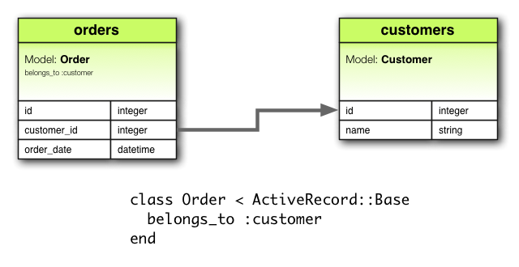
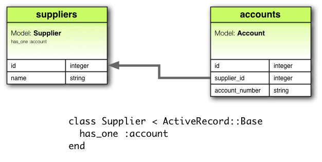
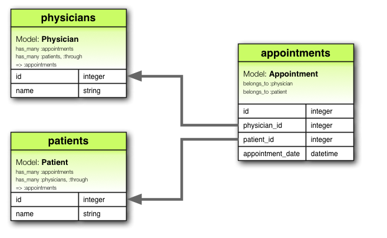
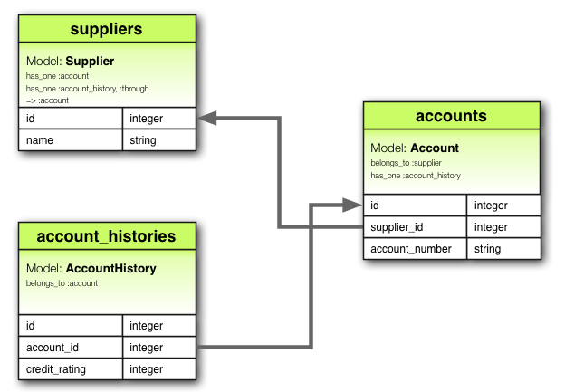

!SLIDE center transition=uncover
# Active Record: asociaciones

!SLIDE bullets small transition=uncover
# Introducción
* Las asociaciones simplifican la interacción entre modelos relacionados

## Asumamos los siguientes modelos

	@@@ruby
	class Customer < ActiveRecord::Base
	end
	 
	class Order < ActiveRecord::Base
	end

!SLIDE bullets small transition=uncover
# Introducción

* Si Los clientes pueden tener varias órdenes, sin asociaciones, la forma de
relacionarlos sería:

## El problema

	@@@ruby
	@order = Order.create(
		order_date: Time.now, 
		customer_id: @customer.id)
	
	# Para eliminar un cliente con sus ordenes:
	@orders = Order.where(customer_id: @customer.id)
	@orders.each do |order|
		order.destroy
	end
	@customer.destroy

!SLIDE bullets small transition=uncover
# La solución

	@@@ruby
	class Customer < ActiveRecord::Base
		has_many :orders, dependent: :destroy
	end
	 
	class Order < ActiveRecord::Base
		belongs_to :customer
	end
	
	# Crear una orden:
	@order = @customer.orders.create(order_date: Time.now)
	
	# Eliminar un cliente:
	@customer.destroy

!SLIDE bullets transition=uncover
# Tipos de asociaciones

* Las asociaciones podrán ser alguna de:
	* `belongs_to`
	* `has_one`
	* `has_many`
	* `has_many :through`
	* `has_one :through`
	* `has_and_belongs_to_many`

!SLIDE bullets transition=uncover
# Asociación `belongs_to`
* Arma una relación **uno a uno** con otro modelo
* En general se usa combinado con una asociación `has_many` o `has_one` desde el otro modelo

## Ejemplo
Clientes con múltiples órdenes, donde cada orden es de un cliente

!SLIDE smbullets transition=uncover
# Asociación `belongs_to`
* Es importante destacar que las asociaciones `belongs_to` deben usar términos
  en singular.
  * En el ejemplo anterior si se hubiese utilizado `cutomers` en la asociación,
    entonces surgiría un error indicando que `Order::Customers` es una constante
    no inicializada
  * Esto se debe a que rails infiere el nombre de la clase a partir del nombre
    de la asociación. 

!SLIDE smbullets transition=uncover small
# Migración correspondiente al `belongs_to`
	@@@ ruby
	class CreateOrders < ActiveRecord::Migration
		def change
			create_table :customers do |t|
				t.string :name
				t.timestamps null: false
			end
	 
			create_table :orders do |t|
				t.belongs_to :customer, index: true
				t.datetime :order_date
				t.timestamps null: false
			end
		end
	end	

!SLIDE bullets transition=uncover small
# Asociación `has_one`
* Arma una relación **uno a uno** con otro modelo pero con una semántica diferente a la de `belongs_to`
* Esta asociación se utiliza para denotar relaciones uno a uno únicamente

## Ejemplo
Proveedores con una cuenta

!SLIDE smbullets transition=uncover small
# Migración correspondiente al `has_one`
	@@@ ruby
	class CreateSuppliers < ActiveRecord::Migration
		def change
			create_table :suppliers do |t|
				t.string :name
				t.timestamps null: false
			end
	 
			create_table :accounts do |t|
				t.belongs_to :supplier, index: true
				t.string :account_number
				t.timestamps null: false
			end
		end
	end

* Notar que `has_one` se coloca en la clase opuesta donde existe la clave foránea
* Esto es porque su uso es similar a la asociación `has_many` pero se utilizará 
	en casos de relaciones uno a uno en vez de uno a muchos

!SLIDE bullets transition=uncover smaller
# Asociación `has_many`
* Arma una relación **uno a muchos** con otro modelo: este modelo puede tener 
	cero o más instancias del modelo mencionado
* Generalmente se encontrará en *el otro lado* de una asociación `belongs_to`

## Ejemplo
En el ejemplo de las órdenes y clientes

!SLIDE smbullets transition=uncover small
# Migración correspondiente al `has_many`
	@@@ ruby
	class CreateOrders < ActiveRecord::Migration
		def change
			create_table :customers do |t|
				t.string :name
				t.timestamps null: false
			end
	 
			create_table :orders do |t|
				t.belongs_to :customer, index: true
				t.datetime :order_date
				t.timestamps null: false
			end
		end
	end	

Es similar a la migración del ejemplo del `belongs_to`

!SLIDE bullets transition=uncover
# Asociación `has_many :through`
* Generalmente usada en relaciones **muchos a muchos** con otro modelo
* Esta asociación indica que el modelo que la declara puede disponer de cero o
  más instancias del otro modelo, a través de un tercer modelo

!SLIDE bullets transition=uncover
# Asociación `has_many :through`
## Ejemplo
Turnos médicos que son solicitados por pacientes para ser atendidos por médicos

!SLIDE bullets transition=uncover small
# Asociación `has_many :through`

	@@@ ruby
	class Physician < ActiveRecord::Base
		has_many :appointments
		has_many :patients, through: :appointments
	end
	 
	class Appointment < ActiveRecord::Base
		belongs_to :physician
		belongs_to :patient
	end
	 
	class Patient < ActiveRecord::Base
		has_many :appointments
		has_many :physicians, through: :appointments
	end

!SLIDE smbullets transition=uncover small
# Migración correspondiente al `has_many :through`

	@@@ruby
	class CreateAppointments < ActiveRecord::Migration
		def change
			create_table :physicians do |t|
				t.string :name
				t.timestamps null: false
			end
	 
			create_table :patients do |t|
				t.string :name
				t.timestamps null: false
			end
	 
			create_table :appointments do |t|
				t.belongs_to :physician, index: true
				t.belongs_to :patient, index: true
				t.datetime :appointment_date
				t.timestamps null: false
			end
		end
	end

!SLIDE bullets transition=uncover
# Asociación `has_one :through`
* Generalmente usada en relaciones **uno a uno** con otro modelo
* Esta asociación indica que el modelo que la declara puede disponer de una 
	instancia de otro modelo accesible a través de un tercer modelo

!SLIDE bullets transition=uncover
# Asociación `has_one :through`
## Ejemplo
Un proveedor tiene una cuenta y cada cuenta tiene asociado un histórico de una la cuenta

!SLIDE smbullets transition=uncover small
# Ejemplo

	@@@ruby
	class Supplier < ActiveRecord::Base
		has_one :account
		has_one :account_history, through: :account
	end
	 
	class Account < ActiveRecord::Base
		belongs_to :supplier
		has_one :account_history
	end
	 
	class AccountHistory < ActiveRecord::Base
		belongs_to :account
	end

!SLIDE smbullets transition=uncover small
# Migración correspondiente al `has_one :through`

	@@@ruby
	class CreateAccountHistories < ActiveRecord::Migration
		def change
			create_table :suppliers do |t|
				t.string :name
				t.timestamps null: false
			end
	 
			create_table :accounts do |t|
				t.belongs_to :supplier, index: true
				t.string :account_number
				t.timestamps null: false
			end
	 
			create_table :account_histories do |t|
				t.belongs_to :account, index: true
				t.integer :credit_rating
				t.timestamps null: false
			end
		end
	end

!SLIDE bullets transition=uncover
# Asociación `has_and_belongs_to_many 
* Crea una relación directa **muchos a muchos** con otro modelo sin un modelo interviniente

!SLIDE bullets transition=uncover smaller
# Asociación `has_and_belongs_to_many
## Ejemplo
Un montaje compuesto de muchas piezas, que puedan aparecer en muchos montajes

!SLIDE smbullets transition=uncover smaller
# Migración correspondiente al `has_and_belongs_to_many`

	@@@ruby
	class CreateAssembliesAndParts < ActiveRecord::Migration
		def change
			create_table :assemblies do |t|
				t.string :name
				t.timestamps null: false
			end
	 
			create_table :parts do |t|
				t.string :part_number
				t.timestamps null: false
			end
	 
			create_table :assemblies_parts, id: false do |t|
				t.belongs_to :assembly, index: true
				t.belongs_to :part, index: true
			end
		end
	end

!SLIDE bullets transition=uncover smaller
# Asociaciones polimórficas
* Un modelo puede pertenecer a uno o más modelos en una misma asociación

## Ejemplo
Una imagen puede pertenecer a un empleado o un producto

	@@@ ruby
	class Picture < ActiveRecord::Base
		belongs_to :imageable, polymorphic: true
	end
	 
	class Employee < ActiveRecord::Base
		has_many :pictures, as: :imageable
	end
	 
	class Product < ActiveRecord::Base
		has_many :pictures, as: :imageable
	end

!SLIDE bullets transition=uncover smaller
# Asociaciones polimórficas
* Desde una instancia de empleado es posible obtener las imágenes usando
	`@employee.pictures`
* De igual forma es posible `@product.pictures`
* También es posible `@picture.imageable`

!SLIDE smbullets transition=uncover smaller
# Migración correspondiente a la asociación polimórfica

	@@@ruby
	class CreatePictures < ActiveRecord::Migration
		def change
			create_table :pictures do |t|
				t.string  :name
				t.integer :imageable_id
				t.string  :imageable_type
				t.timestamps null: false
			end
	 
			add_index :pictures, :imageable_id
		end
	end

!SLIDE smbullets transition=uncover smaller
# Migración correspondiente a la asociación polimórfica

## Similarmente

	@@@ruby
	class CreatePictures < ActiveRecord::Migration
		def change
			create_table :pictures do |t|
				t.string :name
				t.references :imageable, polymorphic: true, 
						index: true
				t.timestamps null: false
			end
		end
	end

!SLIDE smbullets transition=uncover smaller
# Asociaciones conmigo mismo

	@@@ ruby
	class Employee < ActiveRecord::Base
		has_many :subordinates, class_name: "Employee",
								foreign_key: "manager_id"
	 
		belongs_to :manager, class_name: "Employee"
	end

## Migración

	@@@ruby
	class CreateEmployees < ActiveRecord::Migration
		def change
			create_table :employees do |t|
				t.references :manager, index: true
				t.timestamps null: false
			end
		end
	end

