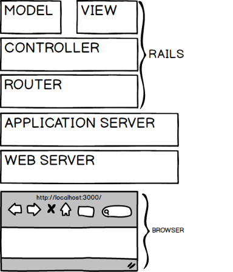

!SLIDE smbullets transition=uncover smaller
# Request & response
* Analizaremos el patron MVC desde la perspectiva de la web
* Debemos considerar que la WEB no es más que navegadores que solicitan páginas
  a un servidor
* Los navegadores realizan **requerimientos** (request)
* Los servidores **responden** (response) a estos requerimientos, enviando, por ejemplo, un
  HTML.
	* Dependiendo en los encabezados del HTML, el navegador deberá realizar más
	  requerimientos para obtener estilos, javascripts e imagenes
* La simplicidad de HTTP hace que no haya más que los requerimientos de un
  navegador y las respuestas de un servidor
	* Hoy día existe además el streaming de audio/video que requieren un pipe
	  entre el navegador y el servidor, pero aún así, un requerimiento y respuesta inicial 
		hacen posible la incialización del stream

!SLIDE smbullets transition=uncover smaller
# El ciclo request / response

!SLIDE smbullets transition=uncover small
# Analizando el ciclo desde el navegador
* Es aconsejable usar [Google Chrome](https://www.google.com/chrome)
* Antes de investigar algo, es conveniente utilizar el **modo incógnito**: que
  se accede usando **Shift+Ctrl+N** (**Shift+Ctrl+P** en Firefox)
	* Alternativamente puede limpiarse la caché del navegador para así limpiar
	  cualquier solicitud previamente cacheada por el navegador 
* Abrimos la vista *Developer Tools* usando **Shift+Ctrl+I**
	* Seleccionamos el tab **Network**
	* Realizamos el requerimiento [http://localhost:3000/about.html](http://localhost:3000/about.html)
	* Visualizaremos los archivos recibidos desde el servidor: sólo uno
	  **about.html**
!SLIDE smbullets transition=uncover small
# Analizando el ciclo desde el navegador
## Así debe verse el requerimiento

!SLIDE smbullets transition=uncover small
# Analizando el ciclo desde el navegador
## Notar cuando no es "fresco" el requerimineto

!SLIDE bullets transition=uncover small
# El detalle del requerimiento
Cliqueando sobre el nombre del archivo, y luego sobre la solapa **Headers**, se visualiza el detalle del requerimiento y su respuesta

!SLIDE bullets transition=uncover small
# Analizamos lo que muestra el navegador
* Que el requerimiento se compone de:
	* Un request a la URL http://localhost:3000/about.html 
	* Que el método HTTP empleado fue GET
	* Los headers del request incluyendo cookies y el identificador del UA
* La respuesta se compone de:
	* El código de estado: 200 OK o 304 Not modified
	* Los headers de la respuesta: incluyendo fecha y hora, así como el
	  identificador del servidor
	* HTML

Ahora podemos analizar cómo el requerimiento a **http://localhost:3000/**
devuelve dos entradas por el redirect

!SLIDE bullets transition=uncover small
# Analizamos ahora desde el lado del servidor
* Hasta ahora vimos las herramientas que disponemos desde el navegador
	* Pero no podemos visualizar qué es lo que sucede en el servidor

## La ventana de consola del servidor muestra:

	@@@ bash
	Started GET "/" for 127.0.0.1 at ...

* Es importante destacar que no hay logs para los archivos servidos desde la
  carpeta `public/`

!SLIDE bullets transition=uncover small
# MVC
El siguiente gráfico muestra qué sucede en el servidor durante el ciclo
request-response 

Algunos expertos opinan que la arquitectura de la web no se ajusta al original
  diseño de MVC creado para aplicaciones visuales de escritorio

!SLIDE bullets transition=uncover 
# MVC en rails

!SLIDE smbullets transition=uncover 
# MVC en rails
* En la base del stack está el navegador: el requerimiento fluye subiendo por
  las capas hasta llegar al **router** que despachará al controlador apropiado
* Existe un único `config/routes.rb` y múltiples controladores, modelos y vistas
* El controlador, al recibir el flujo, obtendrá datos de algún **modelo**
* Con los datos listos, el controlador renderizará la respuesta combinando los
  datos del modelo con una componente de **vista** que provea layout y markup

!SLIDE smbullets transition=uncover 
# MVC en rails
* Los archivos del model, controller y view serán código ruby
* Cada archivo tendrá una estructura y sintaxis específica basada en cómo se ha
  definido por el mismo framework
* Cada model, view y controller que creemos *heradará* comportamiento de
  superclases que son parte del farmework, minimizando lo que debemos codificar

!SLIDE smbullets transition=uncover 
# Models en Rails
* En la mayor parte de las aplicaciones rails, un modelo obtiene datos de una base de datos
* Sin embargo, en otros casos se obtienen de conexiones a otros servidores
* Ejemplos:
	* El model **User** podría obtener el nombre y email desde una base de datos
	  local
	* El mismo modelo, podría además obtener los tweets recientes de Twitter para
	  este mismo usuario, o la ciudad en la que vive desde Facebook

!SLIDE smbullets transition=uncover 
# Controllers en Rails
* Un controlador podría obtener datos de más de un modelo si fuera necesario
* Generalmente un controlador posee más de una **acción**.
	Por ejemplo, un controlador para User podría tener acciones para listar los
usuarios, agregar o eliminar un usuario de la lista
* El archivo `config/routes.rb` macheará el requermiento web a una acción del
  controlador
* En Rails se trata de limitar las acciones en un controlador a las siete
  acciones siguientes: `index`, `show`, `new`, `create`, `edit`, `update` y
`destroy`
	* Un controlador que implementa estas acciones se dice que es **RESTful**

!SLIDE smbullets transition=uncover small
# Views en Rails
* Una vista combina código ruby con markup HTML. 
* Generalmente tendremos una vista asociada a cada acción de un controlador
	* Una vista para **index** debería mostrar una lista de usuarios
	* La vista **show** proveerá detalles del perfil de un usuario
* Las vistas tendrán una sintaxis muy similar a HTML convencional, pero con
  algunos datos que se extraen de variables ruby o estructuras de control como
loops que permitirán crear tablas.
	* Siguiendo el principio de SoC, es considerada una buena práctica limitar el
uso de código ruby en las vistas a sólo utilizarlo para imprimir valores de
variables.
	* Cualquier otra cosa será responsabilidad del modelo
* No todas las acciones tendrán una vista: por ejemplo la acción **destroy**
  usualmente redirige al **index**, y **create** redirige o al **show** o al
**new**
