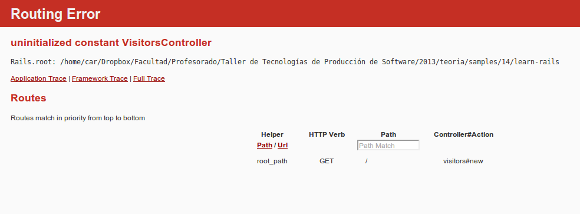

!SLIDE smbullets transition=uncover
# Home dinámica
Planificamos nuestro trabajo definiendo un User story

	@@@ 
	*Birthday countdown*
	As a visitor to the website
	I want to see the owner's name
	I want to see the owner's birthdate
	I want to see how many days until the 
	  owner's next birthday
	In order to send birthday greetings

!SLIDE smbullets transition=uncover small
# La elección de nombres
* Mucho en el arte de la programación radica en elegir nombres correctos para
  nuestras creaciones
* Necesitamos un modelo como origen datos que represente el site owner. 
	* Elegiremos el nombre más obvio: **Owner** y cremos el archivo
`app/models/owner.rb`
* El nombre del controlador abre otro debate
	* Nos podríamos tentar por *Home controller* o *Welcome controller*
	* Si bien son nombres aceptables, si consideramos el **User Story** el nombre
	  **Visitors controller** es más adecuado porque **visitor** es el actor
	* Creamos entonces `app/controllers/visitors_controller.rb`

!SLIDE smbullets transition=uncover smaller
# Convenciones de nombres
* En rails es importante como se llaman los archivos y clases definidas en
  ellos.
* Esto se debe al principio CoC
* Esto evita configuraciones innecesarias
* Al escribir código
	* `class Visitor < ActiveRecord::Base` - los nombres de las clases de modelo
	  son en singular y en mayúscula
	* `class VisitorsController < ApplicationController` - los nombres de
	  controladores son la combinación de un nombre de modelo en singular con
*Controller* en camel case
* Los archivos:
	* Los archivos de modelo coinciden con el nombre del modelo , pero en
	  minúscula: `app/models/visitor.rb`
	* Los archvios de controlador coinciden con la clase, pero usando snake case:
  `app/controllers/visitors_controller.rb`
	* La carpeta de las vistas coinciden con el nombre de la clase del modelo,
	  pero en plural y en minúscula: `app/views/visitors`

!SLIDE smbullets transition=uncover smaller
# Routing
Crearemos primero el ruteo antes de implementar el model y controller

## Editamos `config/routes.rb`

	@@@ ruby
	LearnRails::Application.routes.draw do
		root to: 'visitors#new'
	end

* Notramos que el nombre del módulo donde se define **Application.routes** es
  **LearnRails**
	* Esto se debe al nombre de la aplicación que creamos con el comando `rails
	  new learn_rails`
* Los detalles de la sintaxis en el arcchivo `config/routes.rb` pueden
  entenderse bien leyendo [Rails Guide: Routing from outside in](http://guides.rubyonrails.org/routing.html)
* Modificando `config/routes.rb` no requiere reiniciar la aplicación

!SLIDE bullets transition=uncover 
# Probamos http://localhost:3000

## Esperamos obtener un error

El error es claro: **uninitialized constant VisitorsController** indicando que
Rails busca la clase y no puede encontrarla

Podemos mejorar el error agregando la gema `better_errors` al `Gemfile`

!SLIDE bullets transition=uncover 
# El mismo error con better_errors

## Mensajes más claros

Si hacemos caso al mensaje marcado en rojo, podemos agregar nua consola REPL
como irb que nos permitirá debugear el código. 
El mensaje sugiere agregar la gema `binding_of_caller` al `Gemfile`

!SLIDE bullets transition=uncover 
# El mismo error con better_errors

## Mensajes más claros + consola

!SLIDE smbullets transition=uncover 
# El modelo

* La mayoría de los modelos rails obtienen datos desde una base de datos
* Cuando se utiliza una base de datos, es posible usar el comando: `rails
  generate model` para crear un modelo que hereda de **ActiveRecord**
y conoce como conectarse con la base de datos
* Para este ejemplo no necesitamos una base de datos
	* Nuestra clase simplemente definirá los métodos necesarios

!SLIDE bullets transition=uncover smaller
# Implementamos el Modelo

	@@@ ruby
	class Owner
		def name
			name = 'Foobar Kadigan'
		end

		def birthdate
			birthdate = Date.new(1990, 12, 22)
		end

		def countdown
			today = Date.today
			birthday = Date.new(today.year, 
							birthdate.month, 
							birthdate.day)
			if birthday > today
				countdown = (birthday - today).to_i
			else
				countdown = (birthday.next_year - today).to_i
			end
		end
	
	end

!SLIDE bullets transition=uncover smaller
# La Vista
* Como ya mencionamos en las convenciones de nombres, las vistas van en
  `app/views/`
* En una aplicación convencional, un controlador puede renderizar múltiples
  vistas, por lo tanto se crea un directorio para cada controlador
  * En nuestro caso creamos `mkdir app/views/visitors`

## Creamos entonces `app/views/visitors/new.html.erb`

	@@@ html
	<h3>Home</h3>
	
Welcome to the home of <%= @owner.name %>.

	
I was born on <%= @owner.birthdate %>.

	
Only <%= @owner.countdown %> days until my birthday!

!SLIDE smbullets transition=uncover smaller
# La Vista
* Con lo anterior tenemos únicamente la vista **new** para el controlador
  visitor
* La extensión es **erb** porque usamos el motor ERB para armar nuestros
  templates
* En el ejemplo, y por defecto en rails, se utiliza ERB en rails, pero es posible utilizar gemas que
  proveen [Haml](http://railsapps.github.io/rails-haml.html) o [Slim](http://slim-lang.com/) como motores de templating. 
	* Si usaramos por ejemplo haml, la vista sería **new.html.haml**
* En la vista, podemos ver que el markup de ERB utiliza los tags `<%=` y
  `%>`
* El acceso a los datos del modelo **Owner** se hace a través de `@owner`
	* Esto se entenderá mejor cuando creemos el controlador
* Podríamos preguntarnos por qué usar `<%= @owner.countdown %>` en vez de `<%=
  (Date.new(today.year, @owner.birthdate.month, @owner.birthdate.day) -
Date.today).to_i %>`
	* Podríamos hacerlo, pero violaríamos SoC

!SLIDE smbullets transition=uncover
# El controlador
* Será el *pegamento* entre el modelo Owner y la vista
  **VisitorsController#new**
	* Cuando hagamos referencia a una acción en un controlador, usaremos la
	  notación *VisitorsController#new* uniendo el nombre de la clase del
controlador con el de la acción (que es un método). En este contexto, el
caracter **#** es una convención usada en la documentación 
	* El nombre de la clase será `VisitorsController` pero el nombre del archivo
	  **visitors_controller.rb**

!SLIDE smbullets transition=uncover small
# Escribimos el controlador
	@@@ ruby
	class VisitorsController < ApplicationController
		def new
			@owner = Owner.new
		end
	end
