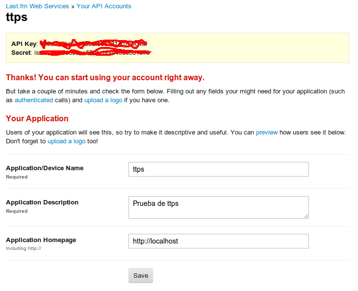

HTTP y Sinatra
==============
\

5 - La página que muestra el estado del tiempo actual:
[http](http://clima.info.unlp.edu.ar/)[://](http://clima.info.unlp.edu.ar/)[clima](http://clima.info.unlp.edu.ar/)[.](http://clima.info.unlp.edu.ar/)[info](http://clima.info.unlp.edu.ar/)[.](http://clima.info.unlp.edu.ar/)[unlp](http://clima.info.unlp.edu.ar/)[.](http://clima.info.unlp.edu.ar/)[edu](http://clima.info.unlp.edu.ar/)[.](http://clima.info.unlp.edu.ar/)[ar](http://clima.info.unlp.edu.ar/)
utiliza un servicio similar al empleado por el sitio
[http](http://www.info.unlp.edu.ar/)[://](http://www.info.unlp.edu.ar/)[www](http://www.info.unlp.edu.ar/)[.](http://www.info.unlp.edu.ar/)[info](http://www.info.unlp.edu.ar/)[.](http://www.info.unlp.edu.ar/)[unlp](http://www.info.unlp.edu.ar/)[.](http://www.info.unlp.edu.ar/)[edu](http://www.info.unlp.edu.ar/)[.](http://www.info.unlp.edu.ar/)[ar](http://www.info.unlp.edu.ar/).
Este servicio puede consultarse usando la URL:
[http](http://clima.info.unlp.edu.ar/last?lang=es)[://](http://clima.info.unlp.edu.ar/last?lang=es)[clima](http://clima.info.unlp.edu.ar/last?lang=es)[.](http://clima.info.unlp.edu.ar/last?lang=es)[info](http://clima.info.unlp.edu.ar/last?lang=es)[.](http://clima.info.unlp.edu.ar/last?lang=es)[unlp](http://clima.info.unlp.edu.ar/last?lang=es)[.](http://clima.info.unlp.edu.ar/last?lang=es)[edu](http://clima.info.unlp.edu.ar/last?lang=es)[.](http://clima.info.unlp.edu.ar/last?lang=es)[ar](http://clima.info.unlp.edu.ar/last?lang=es)[/](http://clima.info.unlp.edu.ar/last?lang=es)[last](http://clima.info.unlp.edu.ar/last?lang=es)[?](http://clima.info.unlp.edu.ar/last?lang=es)[lang](http://clima.info.unlp.edu.ar/last?lang=es)[=](http://clima.info.unlp.edu.ar/last?lang=es)[es](http://clima.info.unlp.edu.ar/last?lang=es)

Usá el comando curl para consultar el servicio

\

6 - Ingresá en Last.fm:
[http](http://www.lastfm.es/)[://](http://www.lastfm.es/)[www](http://www.lastfm.es/)[.](http://www.lastfm.es/)[lastfm](http://www.lastfm.es/)[.](http://www.lastfm.es/)[es](http://www.lastfm.es/)[/](http://www.lastfm.es/)
y:

6.1 - Si aún no tenés una cuenta, create una

6.2 - Ingresá luego a:
[http](http://www.lastfm.es/api/)[://](http://www.lastfm.es/api/)[www](http://www.lastfm.es/api/)[.](http://www.lastfm.es/api/)[lastfm](http://www.lastfm.es/api/)[.](http://www.lastfm.es/api/)[es](http://www.lastfm.es/api/)[/](http://www.lastfm.es/api/)[api](http://www.lastfm.es/api/)[/](http://www.lastfm.es/api/)

6.3 - Creá una API para una aplicación de prueba. Por ejemplo:

\

6.4 - Tomá nota de tu API key

6.5 - Usá curl para consultar los datos de un artista. Información en
[http](http://www.lastfm.es/api/show/album.search)[://](http://www.lastfm.es/api/show/album.search)[www](http://www.lastfm.es/api/show/album.search)[.](http://www.lastfm.es/api/show/album.search)[lastfm](http://www.lastfm.es/api/show/album.search)[.](http://www.lastfm.es/api/show/album.search)[es](http://www.lastfm.es/api/show/album.search)[/](http://www.lastfm.es/api/show/album.search)[api](http://www.lastfm.es/api/show/album.search)[/](http://www.lastfm.es/api/show/album.search)[show](http://www.lastfm.es/api/show/album.search)[/](http://www.lastfm.es/api/show/album.search)[album](http://www.lastfm.es/api/show/album.search)[.](http://www.lastfm.es/api/show/album.search)[search](http://www.lastfm.es/api/show/album.search)

\

*Considere****que****por****ejemplo****para****buscar******iron************maiden****,**deberá****usar****como****nombre****de****artista******iron******%20******maiden***

\

7 - Usá curl para enviar un GET al servicio
[http](http://echo.httpkit.com/)[://](http://echo.httpkit.com/)[echo](http://echo.httpkit.com/)[.](http://echo.httpkit.com/)[httpkit](http://echo.httpkit.com/)[.](http://echo.httpkit.com/)[com](http://echo.httpkit.com/)[/](http://echo.httpkit.com/).
Luego, enviá un POST con los campos nombre y apellido. Probá lo mismo
con el método PUT

\

8 - Escribí una aplicación Sinatra a la que accediendo por un navegador
web a la ruta **/****saludo******imprima el mensaje *Hola****mundo**!*.
Pero si accede a **/****saludo****/****juan** imprima *Hola****juan**!*

8.1 - Al iniciar la aplicación, leé los mensajes para entender en qué
puerto hay que redireccionar el navegador

8.2 - No te olvides de escribir los tests

\

9 - Creá una aplicación Sinatra como el siguiente ejemplo e iniciala ya
mismo

\

**get****'/****codigo****/:****code****'****do****\
****Integer****(****params****[:****code****])\
****end**

\

9.1 - Usá Google Chrome y presionar F12 para mostrar las Dev Tools. Esto
mostrará una ventanita en la parte inferior del navegador. Asegurate de
seleccionar la solapa **Network**

9.2 - Ingresá como URL
[http](http://localhost:4567/codigo/404)[://](http://localhost:4567/codigo/404)[localhost](http://localhost:4567/codigo/404)[:4567/](http://localhost:4567/codigo/404)[codigo](http://localhost:4567/codigo/404)[/404](http://localhost:4567/codigo/404)
y verificá qué muestra la columna Status text. Luego probá con
diferentes valores como 200, 201, 203, 301, 302, 404, 403, 500

9.3 - Verificá los códigos que quieras según
[http](http://en.wikipedia.org/wiki/List_of_HTTP_status_codes)[://](http://en.wikipedia.org/wiki/List_of_HTTP_status_codes)[en](http://en.wikipedia.org/wiki/List_of_HTTP_status_codes)[.](http://en.wikipedia.org/wiki/List_of_HTTP_status_codes)[wikipedia](http://en.wikipedia.org/wiki/List_of_HTTP_status_codes)[.](http://en.wikipedia.org/wiki/List_of_HTTP_status_codes)[org](http://en.wikipedia.org/wiki/List_of_HTTP_status_codes)[/](http://en.wikipedia.org/wiki/List_of_HTTP_status_codes)[wiki](http://en.wikipedia.org/wiki/List_of_HTTP_status_codes)[/](http://en.wikipedia.org/wiki/List_of_HTTP_status_codes)[List](http://en.wikipedia.org/wiki/List_of_HTTP_status_codes)[\_](http://en.wikipedia.org/wiki/List_of_HTTP_status_codes)[of](http://en.wikipedia.org/wiki/List_of_HTTP_status_codes)[\_](http://en.wikipedia.org/wiki/List_of_HTTP_status_codes)[HTTP](http://en.wikipedia.org/wiki/List_of_HTTP_status_codes)[\_](http://en.wikipedia.org/wiki/List_of_HTTP_status_codes)[status](http://en.wikipedia.org/wiki/List_of_HTTP_status_codes)[\_](http://en.wikipedia.org/wiki/List_of_HTTP_status_codes)[codes](http://en.wikipedia.org/wiki/List_of_HTTP_status_codes)

\

10 - Reescribí la aplicación Sinatra del ejercicio 8, pero ahora, en vez
de retornar un string, usá una vista empleando ERB. El template que
usarás, deberá incluir una foto y definir una hoja de estilos que cambie
el color de fondo a rojo ruby!! La variable que seteará el controlador,
deberá usarse por la vista para imprimir el mensaje adecuado. No solo
cambia el mensaje sino el título de la página.

\

11 - Escribí una aplicación Sinatra que tenga 3 rutas:

-   /uno

-   /dos

-   /tres

\

Las tres acciones compartirán la misma vista:

\

**\<****html****\>\
 \<****body****\>\
****Action********called****: \<%=
@****action****\_****name****%\>****at****\<%=@****now****%\>!\
 \</****body****\>\
\</****html****\>**

\

11.1 - Implementá la solución de forma tal que la variable **@****now**,
sólo debe setearse una vez usando filtros.

11.2 - Implementá la solución, pero en vez de usar la variable
**@****now** usá un helper llamado **now**.

\

12**.**1 - Definí un helper de nombre form que reciba los argumentos
method y action y devuelva el código HTML de un formulario. Para simular
métodos que no sean ni GET ni POST el helper deberá generar un form con
método post y agregar un campo oculto con el verbo HTML que realmente
queremos utilizar.

\

Ejemplo: si escribimos en un .erb:

\

**\<%=****form********method****: :****put****,****action****:
'/****number****' %**\>

\

Nuestro helper deberá retornar el string:

\

**\<****form********method****="****post****"****action****='/****number****'\>**

**\<****input********type****="****hidden****"****name****="\_****method****"****value****="****put****"
/\>**

**\</****form****\>**

\

***Nota**:**investigá****la****opción******method******\_******override****.*

\

12.2 - Agregá el helper submit que dado el texto a mostrar deberá
generar un botón submit.

\

Ejemplo: si agregamos en el template:

\

**\<%=****submit****“****Enviar****” %\>**

\

Deberá retornar:

\

**\<****input********type****="****submit****"****value****="****Enviar****"\>**

\

12.3 - El form anterior no es demasiado útil ya que no es sencillo
agregar inputs dentro del formulario. Agregale a form la capacidad de
recibir bloques, en caso que invoquemos a form con un bloque deberá
ejecutarlo para generar todos los inputs que le pidamos.

\

Ejemplo: si agregamos una ruta “/login”:

\

**get****'/****login****'****do**

**form********method****: :****post****,****action****: '/****login****'
{****submit****'****Entrar****' }**

**end**

\

En el cliente deberá recibir:

\

**\<****form********method****="****post****"****action****="/****login****"\>**

**\<****input********type****="****submit****"****value****="****Entrar****"\>**

**\</****form****\>**

\

*Nota**:**La****indentación****está****sólo****por****claridad**,**no****es****necesario****generar****el****código****de****salida****indentado**.*

\

13 - Armar un examen multiple-choice con 5 preguntas de Ruby e
implementar una aplicación Sinatra que permita tomar ese examen. El
funcionamiento de la aplicación deberá ser el siguiente:

13.1 - **/** y **/****login** permiten a un alumno iniciar una sesión
escribiendo su nombre y luego redirigen a la primer pregunta.

13.2 - **/****question****/:****number** muestra la pregunta al alumno,
un botón retroceder y un botón de avanzar.

13.3 - **/****califications** muestra el número de intentos, la
calificación de cada intento y la calificación total.

\

Observaciones:

-   Utilizar la cookie session para persistir los datos.

-   Para acceder a **/****question****/:****number** y a
    **/****califications** es necesario estar logeado, caso contrario
    redirigir a **/****login**.

-   En todas las ventanas deberá haber un link que permita desloguearse.

-   En cada sesión un usuario puede rendir hasta 3 veces, luego deberá
    mostrarse un mensaje indicando que no se puede volver a rendir el
    examen cuando el usuario intente acceder a
    **/****question****/:****number**.

-   La nota se calcula como el promedio de todos los intentos
    penalizando con un 10% en cada intento extra.

\

14 - Implementá un acortador de URLs. Lo que vamos a hacer con un
acortador de urls es permitir a los usuarios que a partir de una URL
extensa, como por ejemplo
[http](http://en.wikipedia.org/wiki/Representational_state_transfer#RESTful_web_APIs)[://](http://en.wikipedia.org/wiki/Representational_state_transfer#RESTful_web_APIs)[en](http://en.wikipedia.org/wiki/Representational_state_transfer#RESTful_web_APIs)[.](http://en.wikipedia.org/wiki/Representational_state_transfer#RESTful_web_APIs)[wikipedia](http://en.wikipedia.org/wiki/Representational_state_transfer#RESTful_web_APIs)[.](http://en.wikipedia.org/wiki/Representational_state_transfer#RESTful_web_APIs)[org](http://en.wikipedia.org/wiki/Representational_state_transfer#RESTful_web_APIs)[/](http://en.wikipedia.org/wiki/Representational_state_transfer#RESTful_web_APIs)[wiki](http://en.wikipedia.org/wiki/Representational_state_transfer#RESTful_web_APIs)[/](http://en.wikipedia.org/wiki/Representational_state_transfer#RESTful_web_APIs)[Representational](http://en.wikipedia.org/wiki/Representational_state_transfer#RESTful_web_APIs)[\_](http://en.wikipedia.org/wiki/Representational_state_transfer#RESTful_web_APIs)[state](http://en.wikipedia.org/wiki/Representational_state_transfer#RESTful_web_APIs)[\_](http://en.wikipedia.org/wiki/Representational_state_transfer#RESTful_web_APIs)[transfer](http://en.wikipedia.org/wiki/Representational_state_transfer#RESTful_web_APIs)[\#](http://en.wikipedia.org/wiki/Representational_state_transfer#RESTful_web_APIs)[RESTful](http://en.wikipedia.org/wiki/Representational_state_transfer#RESTful_web_APIs)[\_](http://en.wikipedia.org/wiki/Representational_state_transfer#RESTful_web_APIs)[web](http://en.wikipedia.org/wiki/Representational_state_transfer#RESTful_web_APIs)[\_](http://en.wikipedia.org/wiki/Representational_state_transfer#RESTful_web_APIs)[APIs](http://en.wikipedia.org/wiki/Representational_state_transfer#RESTful_web_APIs),
puedan compartir un enlace con una url más corta, por ejemplo:
[http](http://example.com/REST)[://](http://example.com/REST)[example](http://example.com/REST)[.](http://example.com/REST)[com](http://example.com/REST)[/](http://example.com/REST)[REST](http://example.com/REST).
Una vez que se accede a esa URL, el acortador debe redirigir al usuario
a la URL completa. La implementación del acortador de url deberá
permitir:

\

\* Que el usuario elija la URL acortada de máximo 8 dígitos

\* Que el acortador decida la URL acortada de máximo 8 dígitos (por
ejemplo usando un hash a partir de la url)

\* Que la url generada sea única

\

Luego, el usuario deberá poder consultar la cantidad de veces que se usó
esa URL acortada.

\

15 - Implementá un servicio web en Sinatra que permita administrar el
stock de productos del ejecicio 12 de la práctica 1. Recordar que un
producto tiene los siguientes atributos:

-   **id**

-   **nombre**

-   **precio**\

La lista de productos se persistirá en alguna estructura de datos que
consideren adecuada utilizando los métodos **::****set****** y
**::****settings****** (ver
[http](http://www.sinatrarb.com/configuration.html)[://](http://www.sinatrarb.com/configuration.html)[www](http://www.sinatrarb.com/configuration.html)[.](http://www.sinatrarb.com/configuration.html)[sinatrarb](http://www.sinatrarb.com/configuration.html)[.](http://www.sinatrarb.com/configuration.html)[com](http://www.sinatrarb.com/configuration.html)[/](http://www.sinatrarb.com/configuration.html)[configuration](http://www.sinatrarb.com/configuration.html)[.](http://www.sinatrarb.com/configuration.html)[html](http://www.sinatrarb.com/configuration.html))

(Nota: tener en cuenta que estos métodos, como explica la documentación,
se utilizan para almacenar parámetros de configuración globales de la
aplicación y no como capa de persistencia. Lo utilizaremos de esta
manera sólo con fin de focalizar el ejercicio)

\
Para las respuestas y parámetros del servicio tenés que usar como media
type el formato JSON.
*Ver*[**](http://www.ruby-doc.org/stdlib-2.0/libdoc/json/rdoc/JSON.html)[*http*](http://www.ruby-doc.org/stdlib-2.0/libdoc/json/rdoc/JSON.html)[*://*](http://www.ruby-doc.org/stdlib-2.0/libdoc/json/rdoc/JSON.html)[*www*](http://www.ruby-doc.org/stdlib-2.0/libdoc/json/rdoc/JSON.html)[*.*](http://www.ruby-doc.org/stdlib-2.0/libdoc/json/rdoc/JSON.html)[*ruby*](http://www.ruby-doc.org/stdlib-2.0/libdoc/json/rdoc/JSON.html)[*-*](http://www.ruby-doc.org/stdlib-2.0/libdoc/json/rdoc/JSON.html)[*doc*](http://www.ruby-doc.org/stdlib-2.0/libdoc/json/rdoc/JSON.html)[*.*](http://www.ruby-doc.org/stdlib-2.0/libdoc/json/rdoc/JSON.html)[*org*](http://www.ruby-doc.org/stdlib-2.0/libdoc/json/rdoc/JSON.html)[*/*](http://www.ruby-doc.org/stdlib-2.0/libdoc/json/rdoc/JSON.html)[*stdlib*](http://www.ruby-doc.org/stdlib-2.0/libdoc/json/rdoc/JSON.html)[*-2.0/*](http://www.ruby-doc.org/stdlib-2.0/libdoc/json/rdoc/JSON.html)[*libdoc*](http://www.ruby-doc.org/stdlib-2.0/libdoc/json/rdoc/JSON.html)[*/*](http://www.ruby-doc.org/stdlib-2.0/libdoc/json/rdoc/JSON.html)[*json*](http://www.ruby-doc.org/stdlib-2.0/libdoc/json/rdoc/JSON.html)[*/*](http://www.ruby-doc.org/stdlib-2.0/libdoc/json/rdoc/JSON.html)[*rdoc*](http://www.ruby-doc.org/stdlib-2.0/libdoc/json/rdoc/JSON.html)[*/*](http://www.ruby-doc.org/stdlib-2.0/libdoc/json/rdoc/JSON.html)[*JSON*](http://www.ruby-doc.org/stdlib-2.0/libdoc/json/rdoc/JSON.html)[*.*](http://www.ruby-doc.org/stdlib-2.0/libdoc/json/rdoc/JSON.html)[*html*](http://www.ruby-doc.org/stdlib-2.0/libdoc/json/rdoc/JSON.html)*,*[**](http://www.json.org/)[*http*](http://www.json.org/)[*://*](http://www.json.org/)[*www*](http://www.json.org/)[*.*](http://www.json.org/)[*json*](http://www.json.org/)[*.*](http://www.json.org/)[*org*](http://www.json.org/)[*/*](http://www.json.org/)

\
Los servicios que tenés que implementar son:

\

-   ***/******products******/*****:****id******

\

Que devuelve el detalle de el producto con dicho id.\
El requerimiento debe ser por GET. Una respuesta satisfactoria devuelve:

\
**{\
 “****product****”: {\
 “****id****”: \<%****id********del********producto****%\>,\
 “****name****”: \<%****nombre********del********producto****%\>,\
 “****price****”: \<%****precio********del********producto****%\>,\
 }\
 }\
**\

Ante un error, como por ejemplo que no exista el producto, deberá
devolver un error 404 (Not found)

\
 **{ “****error****”:
“****Product********does********not********exists****” }\
**\

\

-   ***/******products******/:******id*******

\

Actualiza el producto indicado con los valores enviados.

El requerimiento debe ser **PUT** o **PATCH**. Una respuesta
satisfactoria devuelve:

\
 **{ “****link****”:
“\<%****url********del********recurso********modificado****%\>” }**

\

Si el producto no existe, devuelve un error 404 (Not found)\
\

**{ “****error****”:
“****Product********does********not********exists****” }**

\

Si se modifica el nombre y ya existe un producto con dicho nombre
devuelve un error **409 (****Conflict****)**

\
 **{ “****error****”:
“****Cannot********create********already********existent********product****”
}**\
\

\

-   ***/******products******/******search******/*****:****query**

\

Devuelve una lista de productos cuyo nombre contenga el string que se
envía como criterio de busqueda (:query). Si no se envía un criterio de
búsqueda, devuelve todos los productos.

\

Ante una respuesta satisfactoria devuelve:

\

**{**

“**products****”: [**

**{**

“**id****”: \<%****id********del********producto****%\>,**

“**name****”: \<%****nombre********del********producto****%\>,**

**"****price****”: \<%****precio********del********producto****%\>**

**},**

**{**

“**id****”: \<%****id********del********producto****%\>,**

“**name****”: \<%****nombre********del********producto****%\>,**

**"****price****”: \<%****precio********del********producto****%\>**

**},**

****

**//(...)**

**]**

**}**

\

-   **/****products******

\

Agrega un producto al stock.

El requerimiento debe ser por **POST******con los datos de un producto
en formato json (con la misma estructura definida en los puntos
anteriores). Para esto el request debe llevar la cabecera:

Content-Type: ‘application/json’

\

Una respuesta satisfactoria devuelve un enlace al recurso recién creado:

\
**{ “****link****”:
\<%****url********del********recurso********recién********creado****%\>
}**

\

Todos los campos del producto son obligatorios, por lo tanto, se debe
devolver un error **422 (****Unprocessable********Entity****)** si
alguno falta o está vacío.

**{ “****error****”:
“****Cannot********create********product****.****Invalid********data********submitted****!.”
}**

\

Si ya existe un producto con el mismo nombre se da cuando ya existe un
producto (mismo nombre), devolviendo el error con estado 409 (Conflict)

\
**{ “****error****”:
“****Cannot********create********already********existent********product****”
}**

\

